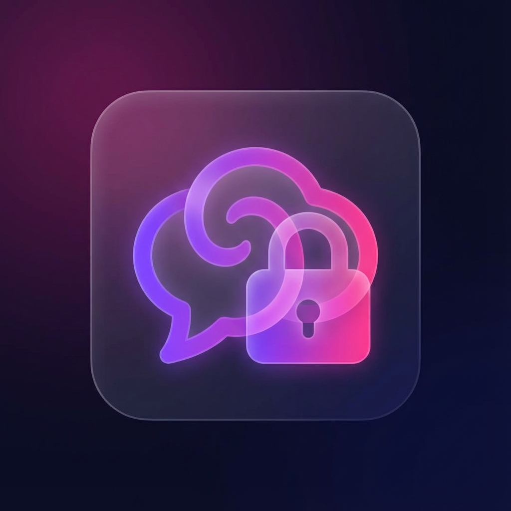

<div align="center">



# 🎭 WhisperVault

### *Your Campus. Your Secrets. Your Voice.*

**Anonymous Campus Confession & Chat Platform**

[](https://nextjs.org/)
[](https://www.typescriptlang.org/)
[](https://socket.io/)
[](https://tailwindcss.com/)
[](https://www.prisma.io/)

[🚀 Live Demo](#) • [📖 Documentation](#) • [🐛 Report Bug](#) • [✨ Request Feature](#)

</div>

---

## 🌟 What is WhisperVault?

WhisperVault is a **viral-worthy anonymous confession and chat platform** designed specifically for college campuses. Share your deepest thoughts, engage with trending confessions, and connect with random strangers - all while maintaining complete anonymity. Built with modern web technologies and a stunning glassmorphic UI.

### 🎯 Why WhisperVault?

- ✅ **100% Anonymous** - No sign-ups, no tracking, no data collection
- ✅ **Real-time Engagement** - Live chat, instant updates, typing indicators
- ✅ **Community-Driven** - Upvote/downvote system, trending feed, tag-based discovery
- ✅ **Premium Design** - Glassmorphism, smooth animations, dark theme
- ✅ **Safe & Moderated** - Report system, auto-moderation, content validation
- ✅ **Mobile-First** - Responsive design that works perfectly on all devices

---

## ✨ Features

### 📝 Anonymous Confessions

<table>
<tr>
<td width="50%">

**Post & Share**
- 🎭 Post completely anonymously
- 📝 Up to 500 characters per confession
- 🏷️ Add custom tags (max 5)
- 🎨 Beautiful share cards with themes
- 📤 Download or share confessions

</td>
<td width="50%">

**Engage & Discover**
- 👍👎 Upvote/downvote system
- 💬 Reply to confessions
- 🔥 Trending feed algorithm
- 🔍 Search by keywords or tags
- 📊 Sort by time, popularity, or trending

</td>
</tr>
</table>

### 💬 Live Anonymous Chat

- 🎲 **Random Matching** - Connect with strangers from your campus
- ⚡ **Real-time Messaging** - Powered by Socket.io for instant delivery
- ✍️ **Typing Indicators** - See when someone is typing
- ⏭️ **Skip Feature** - Move to the next stranger anytime
- 🎭 **Anonymous Names** - Auto-generated fun names like "SilentPanda42"
- 📸 **Image Sharing** - Share images in chat (with moderation)
- 😊 **Emoji Support** - Express yourself with emojis

### 🛡️ Moderation & Safety

- 🚩 **Report System** - Flag inappropriate confessions and replies
- 🤖 **Auto-moderation** - Content with multiple reports gets auto-hidden
- ✅ **Content Validation** - Character limits and input sanitization
- 👮 **Admin Panel** - Comprehensive moderation dashboard
- 📋 **Community Guidelines** - Clear rules for respectful interaction
- 🔒 **IP-based Vote Tracking** - Prevent vote manipulation

### 🎨 Premium Design

- 🌈 **Glassmorphism UI** - Modern, translucent card designs with backdrop blur
- 🌙 **Dark Theme** - Easy on the eyes with vibrant purple/pink gradients
- ✨ **Smooth Animations** - Fade-ins, hover effects, and micro-interactions
- 📱 **Responsive Layout** - Seamless experience on mobile and desktop
- 🎭 **Custom Scrollbars** - Styled to match the glassmorphic theme
- 🎨 **Theme Toggle** - Smooth transitions with View Transitions API
- 🖼️ **Share Card Themes** - Multiple visual themes (love, code, sad, funny, dark)

---

## 🚀 Tech Stack

<table>
<tr>
<td width="50%">

### Frontend
- **Framework**: Next.js 16 (App Router)
- **Language**: TypeScript 5
- **Styling**: Tailwind CSS 4
- **UI Components**: Radix UI
- **Animations**: Framer Motion
- **Icons**: Lucide React
- **Date Formatting**: date-fns

</td>
<td width="50%">

### Backend
- **Real-time**: Socket.io 4.8
- **Database**: Prisma ORM + SQLite/PostgreSQL
- **Caching**: Redis (optional)
- **Authentication**: bcryptjs (admin)
- **Image Processing**: html-to-image
- **State Management**: React Hooks

</td>
</tr>
</table>

---

## 📦 Quick Start

### Prerequisites

- Node.js 18+ installed
- npm or yarn package manager

### Installation

1. **Clone the repository**:
   ```bash
   git clone <your-repo-url>
   cd newproject
   ```

2. **Install dependencies**:
   ```bash
   npm install
   ```

3. **Set up environment variables**:
   Create a `.env.local` file in the root directory:
   ```env
   DATABASE_URL="file:./dev.db"
   ADMIN_PASSWORD="your_secure_password"
   REDIS_URL="redis://localhost:6379" # Optional
   ```

4. **Initialize the database**:
   ```bash
   npx prisma generate
   npx prisma db push
   ```

5. **Run the development server**:
   ```bash
   npm run dev
   ```

6. **Open your browser**:
   Navigate to [http://localhost:3000](http://localhost:3000)

---

## 🎯 Usage Guide

### 📝 Posting a Confession

1. Navigate to the **Feed** or **Trending** tab
2. Use the "Share Your Confession" card in the sidebar
3. Write your confession (max 500 characters)
4. Optionally add tags (max 5) like `#love`, `#college`, `#funny`
5. Click **"Post Anonymously"**
6. Your confession appears instantly in the feed!

### 💬 Interacting with Confessions

- **👍 Upvote/Downvote**: Click the arrows to vote (persists across browsers via IP tracking)
- **💬 Reply**: Click the reply count to expand and add your anonymous reply
- **🚩 Report**: Click the flag icon to report inappropriate content
- **🔍 Search**: Use the search bar to find specific confessions
- **📤 Share**: Click the share button to generate a beautiful share card

### 🎲 Using Anonymous Chat

1. Click the **Chat** tab
2. Wait to be matched with a random stranger
3. Start chatting anonymously with your auto-generated name
4. Click **"Next"** to skip to another stranger
5. Share images or emojis to enhance your conversation

### 👮 Admin Panel

1. Navigate to `/admin`
2. Log in with your admin credentials
3. View all confessions, replies, and reports
4. Approve, delete, or manage content
5. Monitor active users and platform statistics

---

## 🏗️ Project Structure

```
newproject/
├── app/
│   ├── api/
│   │   ├── confessions/
│   │   │   ├── route.ts              # GET/POST confessions
│   │   │   └── reply/route.ts        # POST replies
│   │   ├── vote/route.ts             # POST votes (IP-based)
│   │   ├── report/route.ts           # POST reports
│   │   ├── socket/route.ts           # Socket.io endpoint
│   │   └── admin/
│   │       ├── login/route.ts        # Admin authentication
│   │       └── confessions/route.ts  # Admin confession management
│   ├── admin/
│   │   └── page.tsx                  # Admin panel UI
│   ├── globals.css                   # Global styles & design system
│   ├── layout.tsx                    # Root layout with providers
│   └── page.tsx                      # Main application page
├── components/
│   ├── ConfessionCard.tsx            # Confession display component
│   ├── NewConfession.tsx             # Create confession form
│   ├── Chat.tsx                      # Real-time chat component
│   ├── ShareModal.tsx                # Share card generator
│   ├── AdminPanel.tsx                # Admin dashboard
│   └── ui/                           # Reusable UI components
├── lib/
│   ├── utils.ts                      # Utility functions
│   ├── confessionStoreDB.ts          # Database operations
│   ├── socket.ts                     # Socket.io utilities
│   └── redis.ts                      # Redis client (optional)
├── prisma/
│   ├── schema.prisma                 # Database schema
│   └── migrations/                   # Database migrations
├── types/
│   └── index.ts                      # TypeScript interfaces
├── server.ts                         # Custom server with Socket.io
└── package.json
```

---

## 🎨 Design System

### Color Palette

```css
/* Primary Gradient */
--gradient-primary: linear-gradient(135deg, #8b5cf6 0%, #ec4899 100%);

/* Background Colors */
--bg-primary: #0f0f1e;
--bg-secondary: #1a1a2e;
--bg-tertiary: #16213e;

/* Accent Colors */
--success: #10b981;
--warning: #f59e0b;
--danger: #ef4444;
--info: #3b82f6;

/* Glass Effect */
--glass-bg: rgba(255, 255, 255, 0.05);
--glass-border: rgba(255, 255, 255, 0.1);
--glass-blur: blur(10px);
```

### Key Components

- **🪟 Glass Cards**: Translucent cards with backdrop blur and subtle borders
- **🎨 Gradient Buttons**: Purple-pink gradient with smooth hover effects
- **📝 Input Fields**: Glass-style inputs with focus states and animations
- **🏷️ Badges**: Colored tags for categorization and status
- **🎭 Modals**: Glassmorphic overlays with smooth transitions

---

## 🔧 Configuration

### Environment Variables

Create a `.env.local` file:

```env
# Database
DATABASE_URL="file:./dev.db"                    # SQLite for development
# DATABASE_URL="postgresql://..."              # PostgreSQL for production

# Admin
ADMIN_PASSWORD="your_secure_password_here"

# Redis (Optional - for production scaling)
REDIS_URL="redis://localhost:6379"

# Server
PORT=3000
NODE_ENV=development
```

### Production Deployment

#### Vercel Deployment (Recommended)

1. Push your code to GitHub
2. Import project in Vercel dashboard
3. Add environment variables
4. Deploy!

**Note**: Socket.io features are disabled in production on Vercel due to serverless limitations. For full real-time chat functionality, deploy to a platform that supports WebSockets (Railway, Render, DigitalOcean).

#### Alternative Platforms

- **Railway**: Full Socket.io support
- **Render**: WebSocket support included
- **DigitalOcean**: App Platform with WebSockets
- **AWS/GCP**: EC2/Compute Engine with custom setup

### Production Checklist

- [ ] Replace SQLite with PostgreSQL/MySQL
- [ ] Set up Redis for session management
- [ ] Configure proper CORS settings
- [ ] Enable rate limiting
- [ ] Set up monitoring (Sentry, LogRocket)
- [ ] Configure CDN for static assets
- [ ] Enable database backups
- [ ] Set up SSL certificates
- [ ] Configure environment variables
- [ ] Test Socket.io connectivity

---

## 📱 Roadmap

### Phase 1: Core Features ✅
- [x] Anonymous confessions
- [x] Upvote/downvote system
- [x] Reply functionality
- [x] Live anonymous chat
- [x] Tag system
- [x] Search functionality
- [x] Report system
- [x] Admin panel

### Phase 2: Enhancements 🚧
- [x] IP-based vote tracking
- [x] Share card generation
- [x] Multiple share themes
- [x] Image sharing in chat
- [ ] Emoji reactions on confessions
- [ ] User profiles (optional anonymous)
- [ ] Push notifications

### Phase 3: Scale & Polish 📋
- [ ] Redis integration for scalability
- [ ] PostgreSQL migration
- [ ] AI-powered content moderation
- [ ] Analytics dashboard
- [ ] Mobile app (React Native)
- [ ] Multi-campus support
- [ ] Advanced search filters
- [ ] Confession bookmarking

---

## 🤝 Contributing

We welcome contributions! Here's how you can help:

1. **Fork the repository**
2. **Create a feature branch**: `git checkout -b feature/amazing-feature`
3. **Commit your changes**: `git commit -m 'Add amazing feature'`
4. **Push to the branch**: `git push origin feature/amazing-feature`
5. **Open a Pull Request**

### Development Guidelines

- Follow TypeScript best practices
- Maintain the existing code style
- Write meaningful commit messages
- Test your changes thoroughly
- Update documentation as needed

---

## 📄 License

MIT License - feel free to use this for your campus!

Copyright (c) 2025 WhisperVault

---

## 🎓 Perfect For

- 🏫 College campuses
- 🎓 University communities
- 👥 Student organizations
- 💬 Anonymous feedback platforms
- 🌐 Campus social networks
- 🗣️ Community discussion boards

---

## 🔒 Privacy & Safety

WhisperVault takes privacy seriously:

- ✅ **No personal data collected** - We don't ask for names, emails, or phone numbers
- ✅ **All interactions are anonymous** - Your identity is never revealed
- ✅ **IP addresses not logged** - We use IP hashing only for vote integrity
- ✅ **Messages are ephemeral** - Chat messages are not permanently stored
- ✅ **Report system** - Community-driven content moderation
- ✅ **Auto-moderation** - Flagged content is automatically hidden
- ✅ **Admin oversight** - Dedicated moderation panel for safety

---

## 💡 Tips for Going Viral on Campus

1. **🚀 Launch Strategy**: Start with a small group of friends, let it grow organically
2. **🎉 Campus Events**: Promote during orientation, club fairs, or campus events
3. **📢 Word of Mouth**: Encourage sharing through engaging confessions
4. **🔥 Trending Content**: Highlight the best confessions daily on social media
5. **💬 Engagement**: Respond to confessions to keep the community active
6. **🎨 Branding**: Create stickers, posters, or social media graphics
7. **🏆 Contests**: Run weekly "best confession" contests
8. **📱 Mobile-First**: Ensure the experience is seamless on phones

---

## 🐛 Troubleshooting

### Common Issues

**Chat not connecting?**
- Ensure Socket.io server is running (`npm run dev`)
- Check firewall settings
- Verify WebSocket support in your environment

**Database errors?**
- Run `npx prisma generate` to regenerate Prisma Client
- Run `npx prisma db push` to sync schema changes

**Styling issues?**
- Clear `.next` cache: `rm -rf .next`
- Restart development server

---

## 📞 Support

- 📧 **Email**: support@whispervault.com
- 💬 **Discord**: [Join our community](#)
- 🐛 **Issues**: [GitHub Issues](#)
- 📖 **Docs**: [Documentation](#)

---

<div align="center">

### Made with ❤️ for campus communities

**Star ⭐ this repo if you find it useful!**

[⬆ Back to Top](#-whispervault)

</div>
